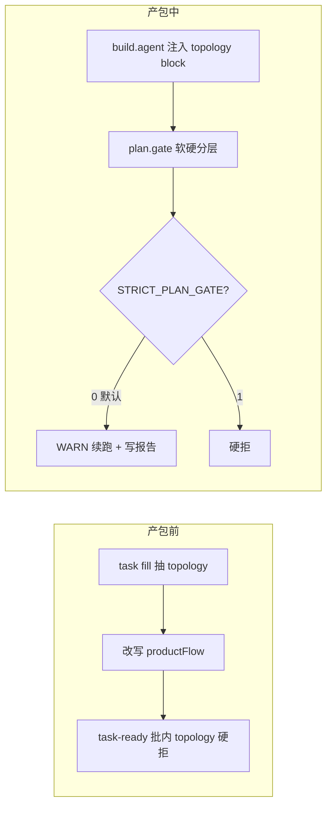

# H5 壳交互拓扑与 Plan Gate 策略

> **版本**：2026-07-13 · **状态**：Phase 2 已落地  
> 配套：《H5壳功能文档深度标准.md》· `interaction_topology.py` · `spec_business_depth.py`  
> 批前主题策略（自拟 brief）由**流水线仓人工**维护，不在产包 Agent 必读封闭语料内。

---

## 0. 前置变更（自拟主题）

**主题库抽题将从批前移除**（iOS 加强后库内主题不可用）。新链路：

`task compose-theme（自拟）` → `task name` → `task fill（topology+productFlow）` → `task ready（叙事硬拒）`

本文件的 topology / soft plan.gate **仍然有效**，但 productFlow 的上游改为**自拟 brief**，不再依赖 `主题编号` + 主题库 6 列。

---

## 1. 要解决的问题

| 现象 | 根因 |
|------|------|
| 批内包都像「填表→列表→详情→导出」 | `theme_fields.generate_product_flow()` 单模板 |
| 改一个全批连锁 | product_flow → PM → 组件 kit → design-system / 视觉锁 → H5 同构 |
| plan.gate 硬拒断线 | Agent 已跑完才罚，续跑成本高 |

---

## 2. 策略总览



---

## 3. 交互拓扑牌组（T1–T8）

文件：`data/decks/interaction-topology-deck.json`  
台账：`data/registry/interaction-topology-ledger.json`

| ID | 标签 | 禁止默认首页 |
|----|------|--------------|
| T1_dashboard | 看板下钻 | chip 列表首屏 |
| T2_capture_first | 先拍后归档 | 筛选列表首页 |
| T3_timeline | 横向时间轴 | 表格式 list |
| T4_wizard | 向导流水线 | 自由浏览 list |
| T5_workspace | 单页画布 | list/detail 栈 |
| T6_checklist_session | 会话清单 | 分类浏览首页 |
| T7_compare_board | 双栏对比 | 单列表浏览 |
| T8_reminder_ring | 提醒环日历 | tag/chip 列表首页 |

**task fill** 批内自动去重分配。

---

## 4. Gate 软硬分层

### 4.1 产包前 `task-ready` — **硬拒**

- CSV 去重、必填、Bridge 七维
- **批内 interactionTopology 重复**

### 4.2 产包中 `plan.gate` — **默认软续跑**

| 类型 | 代号 | 默认 | STRICT=1 |
|------|------|------|----------|
| 文件缺失 / JSON 非法 / 登记必填空 | HARD | 硬拒 | 硬拒 |
| SPEC 业务深度不足 | SOFT | WARN | 硬拒 |
| FLOW 拓扑/同构 | SOFT | WARN | 硬拒 |
| SEL 组件选型（level 1） | SOFT | WARN | 硬拒 |
| 视觉锁 / pages 场景深度不足 | 混合 | 关键字段 HARD | 全 HARD |

环境变量：

| 变量 | 默认 | 说明 |
|------|------|------|
| `STRICT_PLAN_GATE` | `0` | `1` 恢复全硬拒 |
| `ENABLE_PLAN_GATE_REPAIR` | `1` | `0` 关闭定向 repair |
| `PLAN_GATE_REPAIR_MAX_ROUNDS` | `2` | repair 最大轮次 |
| `ENABLE_SPEC_DEPTH_GATE` | `1` | `0` 关闭 SPEC 检查 |
| `ENABLE_FLOW_TOPOLOGY_GATE` | `1` | `0` 关闭 FLOW 检查 |

产出：`plan-gate-report.json`（hard / soft / passed）

---

## 5. 实施清单

| # | 项 | 文件 | 状态 |
|---|-----|------|------|
| 1 | topology deck + ledger | `data/decks/…` `data/registry/…` | ✅ |
| 2 | 抽牌 + productFlow 模板 | `interaction_topology.py` | ✅ |
| 3 | task fill 接线 | `task_add.py` | ✅ |
| 4 | theme_fields / name_generator | 废除 CRUD 单模板 | ✅ |
| 5 | skill-input 写入 topology | `skill_context.py` | ✅ |
| 6 | PM prompt 注入 | `phase_agent_plan_spec.txt` + topology/depth blocks | ✅ |
| 7 | plan.gate 软硬分层 | `pipeline_gates.py` `pipeline_v3_runner.py` | ✅ |
| 8 | task-ready 批内 topology | `batch_firewall.py` | ✅ |
| 9 | 功能文档深度标准 | `H5壳功能文档深度标准.md` | ✅ |
| 10 | 单元测试 | `test_interaction_topology.py` `test_spec_business_depth.py` | ✅ |

---

## 6. 使用

```bash
# 重新分配 topology + productFlow（批内）
./run.sh task-fill --force

./run.sh task-ready

# 默认软 gate 续跑
./run.sh --name {AppName}

# 严格模式（调试规格）
STRICT_PLAN_GATE=1 ./run.sh --name {AppName}
```

---

## 7. L2 验收预期

- topology：**T6_checklist_session** 或 **T8_reminder_ring**（按 seed 批内去重）
- productFlow：会话清单 / 提醒环句式，**非** chip browse 模板
- plan.gate：深度/同构不足 → WARN，流水线继续

---

## 导航

- 《H5壳功能文档深度标准.md》
- 《H5壳Flutter产品要求.md》
- 《H5壳Pack约束.md》
- 流水线仓 `docs/rules/` **勿**作为产包 Agent 必读路径。
